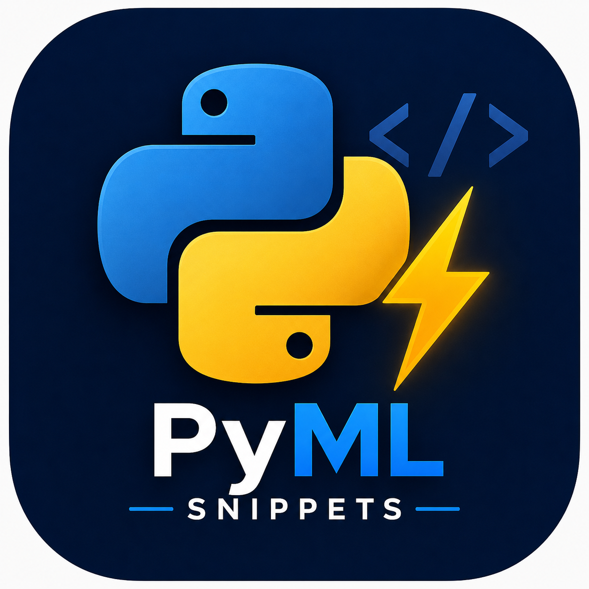
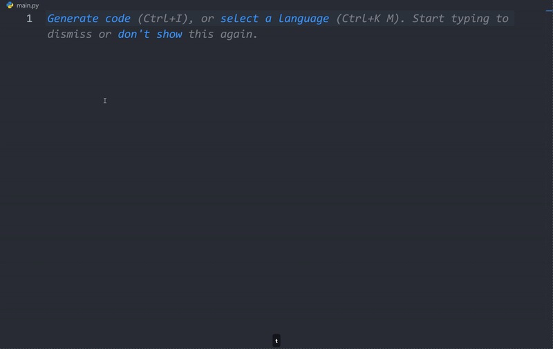

<div align="center">



# 🚀 PyML Snippets

### Supercharge your Python, Data Science & Machine Learning Workflow

Write cleaner code, save time, and boost productivity with **54 ready-to-use Visual Studio Code snippets** for Python, Data Science, Machine Learning, EDA, Data Preprocessing, Visualization, Model Evaluation, and NLP.

<p align="center">


</p>

---

### ⭐ If this extension helps you, don't forget to Star the repository.

</div>

---

# 📖 Overview

PyML Snippets is a lightweight VS Code extension designed for Python developers, Data Scientists, Machine Learning Engineers, and students.

Instead of writing repetitive boilerplate code, simply type a short prefix and press **Tab** to generate complete code instantly.

---

# ✨ Features

- 🚀 54 production-ready snippets
- 🐍 Python development snippets
- 📊 Data Science utilities
- 🤖 Machine Learning models
- 📈 Complete EDA templates
- 🧹 Data preprocessing
- 📉 Visualization snippets
- 🎯 Model evaluation
- 📝 NLP and text processing workflows
- 🔤 Text vectorization and Word2Vec
- 📌 Outlier detection with IQR
- ⚡ Train/Test Split
- 🔍 GridSearchCV
- 🔄 ML Pipelines
- 🧠 Classification & Regression snippets

---


> ## 🎥 Demo

<p align="center">
  
</p>

Example:

```
Type

tts

↓

Press TAB

↓

from sklearn.model_selection import train_test_split

X_train, X_test, y_train, y_test = train_test_split(...)
```

---

# 🚀 Quick Start

### 1. Open a Python file

Create or open any `.py` file.

---

### 2. Type a snippet prefix

Example

```
tts
```

---

### 3. Press

```
TAB
```

Done ✅

---

# 📚 Snippet Library

| Prefix | Description |
|---------|-------------|
| tts | Train Test Split |
| scaler | Standard Scaler |
| minmax | Min Max Scaler |
| one | One Hot Encoding |
| label | Label Encoding |
| npm | Import NumPy, Pandas, Matplotlib and Seaborn |
| metrics | Import and print classification metrics |
| makereg | Create Regression Dataset |
| clfevl | Complete Classification Evaluation |
| pipeline | Pipeline with StandardScaler |
| regeval | Regression Evaluation Metrics |
| fitpred | Fit model and predict |
| makeclf | Create Classification Dataset |
| binaryclf | Binary Classification Dataset |
| imbclf | Imbalanced Classification Dataset |
| grid | GridSearchCV Template |
| compareclf | Compare Multiple Classification Models |
| ctonehot | ColumnTransformer with OneHotEncoder |
| gaussian | Import GaussianNB |
| logistic | Import Logistic Regression |
| knn | Import KNN |
| svc | Import SVC |
| rfc | Import Random Forest |
| linear | Linear Regression Import |
| ridge | Ridge Import |
| lasso | Lasso Import |
| elastic | ElasticNet Import |
| dt | Decision Tree Classifier |
| dtr | Decision Tree Regressor |
| extra | Extra Trees |
| ada | AdaBoost |
| gb | Gradient Boosting |
| histgb | Hist Gradient Boosting |
| eda | Professional EDA Summary |
| edaplot | EDA Correlation Heatmap |
| edashort | Quick EDA |
| csv | Read CSV File |
| heat | Correlation Heatmap |
| hist | Histogram with KDE |
| scatter | Scatter Plot |
| count | Count Plot |
| comparereg | Compare Multiple Regression Models |
| nlp-remove | Complete NLP text cleaning with stopword, URL, HTML tag, and extra space removal |
| lemmatize | Apply lemmatization to a text column using WordNetLemmatizer |
| bagof | Convert text data into Bag of Words representation |
| countvector | Convert text into a numerical matrix using CountVectorizer |
| nlp-corpus | Clean, lowercase, tokenize, remove stopwords, and lemmatize text into a corpus |
| nlp-word2vec | Train and use a Word2Vec model with vocabulary, word vectors, similarity, and similar words |
| nlp-word2vec-google | Load Google's pretrained Word2Vec model and perform word vectors, similarity, and vocabulary operations |
| column-transformer | Create a ColumnTransformer for numerical and categorical features |
| tfidf | Convert text into TF-IDF features with configurable n-grams and frequency thresholds |
| remove-outlier | Detect and remove outliers from a numerical column using the IQR method |
| outlier | Detect outliers in a numerical column using the IQR method |
| nlp-text-classification | Complete NLP text classification workflow using TF-IDF and Logistic Regression |

---

# 💡 Why PyML Snippets?

✅ Save hours of repetitive coding

✅ Write cleaner code

✅ Learn faster

✅ Improve productivity

✅ Beginner Friendly

✅ Perfect for Data Science projects

---

# 🎯 Who is this for?

- Python Developers
- Data Scientists
- Machine Learning Engineers
- AI Enthusiasts
- College Students
- Kaggle Users
- Researchers

---

# 📦 Installation

## From VS Code Marketplace

1. Open Extensions
2. Search **PyML Snippets**
3. Click **Install**

---

## Manual Installation

Install the generated `.vsix` file using:

```
Extensions
↓

...

↓

Install from VSIX...
```

---

# 🛣️ Roadmap

Upcoming updates:

- Pandas snippets
- NumPy snippets
- Seaborn snippets
- Matplotlib snippets
- XGBoost
- LightGBM
- CatBoost
- TensorFlow
- PyTorch
- SHAP
- Optuna
- SQL snippets

---

# 🤝 Contributing

Contributions are welcome!

Feel free to open an Issue or submit a Pull Request.

---

# 👨‍💻 Developer

## Dev_Manish

Python Developer • Data Science • Machine Learning • AI

GitHub

https://github.com/Developer-Manish007

---

# 📄 License

MIT License

---

<div align="center">

## ⭐ Star this repository if you find it useful!

Made with ❤️ by **Dev_Manish**

</div>